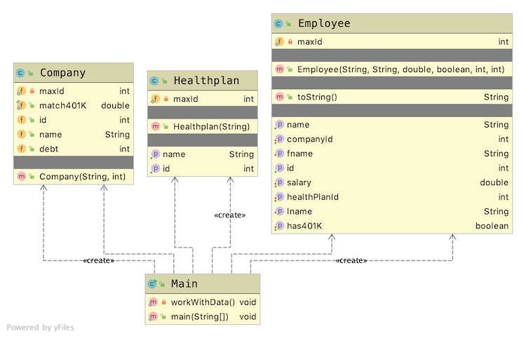

# Java Employee Application

## Introduction

This project is used to introduce

* Java and JDK
* Strongly Typed Aspect of Java
* Object Oriented Aspect of Java

Thus it concentrates on how Classes and Objects are used in a Java program and how data types get implemented in Java.

## Application

### Layout

A Main class with the main starting method calls another method where the actual work is done.

The layout of the application is



### Results

The main method calls another method to do all the work. A series of Java statements are executed to show various aspects of the language. Running the application produces the following output

```Text
*** Query Data
employeeApp.Company@61baa894

Original: 100
Negative: -100


*** Working with Number ***
Original divided 5 20
Original mod 2     0
Original divided 7 14
Original divided 7 14.285714285714286
Original divided 7 14.285714285714286

*** Printing Numbers and Characters ***
Debt: 100100
Debt: 100100

*** Printing Objects ***
employeeApp.Company@61baa894
id: 1
fname: Steve
lname: Green
salary: 45000.0
has401K: true
companyId: 1
healthPlanId: 1


id: 5
fname: My
lname: Name
salary: 45000.0
has401K: true
companyId: 2
healthPlanId: 2


*** Emp1 gets a raise
id: 1
fname: Steve
lname: Green
salary: 46350.0
has401K: true
companyId: 1
healthPlanId: 1


*** 401K amount for emp5
2250.0

*** Company Names ***
Combined
Company A Company B
No Vowels
c_mp_ny _

Steve Green
S t e v e   G r e e n
```
